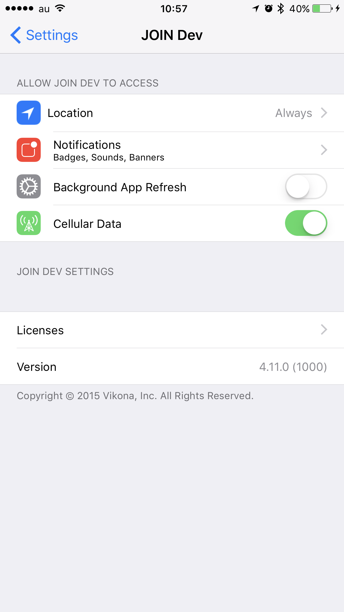
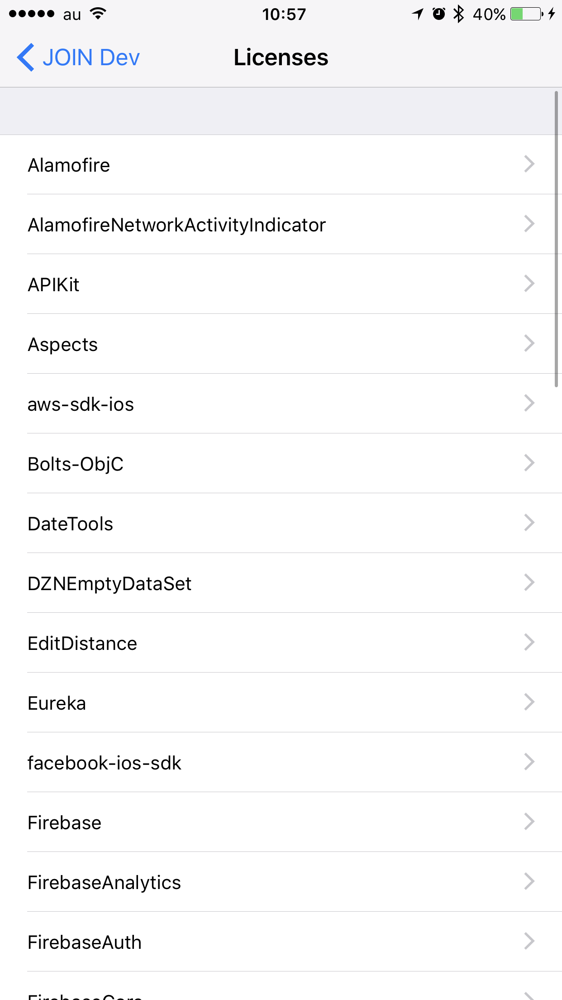
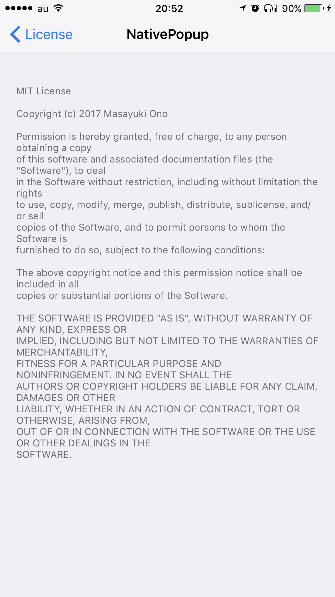

 LicensePlist
======================================


[](https://raw.githubusercontent.com/mono0926/NativePopup/master/LICENSE)
[](https://developer.apple.com/swift)
[](https://github.com/apple/swift-package-manager)

`LicensePlist` is a script that automatically generates a Plist of all your dependencies, including files added manually(specified by [YAML config file](https://github.com/mono0926/LicensePlist/blob/master/Tests/LicensePlistTests/Resources/license_plist.yml)) or using `Carthage` or `CocoaPods`. All these licenses then show up in the Settings app.

App Setting Root | License List | License Detail
--- | --- | ---
 |  | 

## Installation

### Homebrew (Recommended)

```sh
$ brew install mono0926/license-plist/license-plist
```

Or 

```sh
$ brew tap mono0926/license-plist
$ brew install license-plist
```

### Download the executable binary from [Releases](https://github.com/mono0926/LicensePlist/releases)

Download from [Releases](https://github.com/mono0926/LicensePlist/releases), then copy to `/usr/local/bin/license-plist` etc.

Or by using this command, you can also download the latest executable binary.

```sh
curl "https://api.github.com/repos/mono0926/LicensePlist/releases" \
     | jq -r '.[0].assets_url' \
     | xargs -n1 curl \
     | jq -r '.[0].browser_download_url' \
     | xargs -n1 curl -LOk \
 && unzip license-plist.zip
```

### From Source

Clone the master branch of the repository, then run `make install`.

```sh
$ git clone https://github.com/mono0926/LicensePlist.git
$ make install
```

Or you can also install by one-liner.

```sh
curl -fsSL install.sh | sh
```

- **Homebrew**: Not supported yet.

## Usage

1. On the directory same as `Cartfile` or `Pods`, simply execute `license-plist`.
2. `com.mono0926.LicensePlist.Output` directory will be generated.
3. Move the files in the output directory into your app's `Settings.bundle`.
    - [Settings.bundle's sample is here](Settings.bundle.zip)
    - The point is to [specify `com.mono0926.LicensePlist` as license list file on your `Root.plist`](https://github.com/mono0926/LicensePlist/blob/master/Settings.bundle/Root.plist#L19).

```
Settings.bundle
├── Root.plist
├── com.mono0926.LicensePlist
│   ├── APIKit.plist
│   ├── Alamofire.plist
│   └── EditDistance.plist
├── com.mono0926.LicensePlist.plist
├── en.lproj
│   └── Root.strings
└── ja.lproj
    └── Root.strings
```

### Options

You can see options by `license-plist --help`.

#### `--cartfile-path`

- Default: `Cartfile`

#### `--pods-path`

- Default: `Pods`

#### `--output-path`

- Default: `com.mono0926.LicensePlist.Output`
- Recommended: `--output-path YOUR_PRODUCT_DIR/Settings.bundle`


#### `--github-token`

- Default: None.
- `LicensePlist` uses GitHub API, so sometimes API limit error occures, so by using github-token you can avoid it.
- [You can generate token here](https://github.com/settings/tokens/new)
    - `repo` scope is needed.

#### `--config-path`

- Default: `license_plist.yml`
- You can specify GitHub libraries(introduced by hand) and excluded libraries
    - [Example is here](https://github.com/mono0926/LicensePlist/blob/master/Tests/LicensePlistTests/Resources/license_plist.yml)


#### `--force`

- Default: false
- `LicensePlist` saves latest libraries, so if there are no libraries change, iterrupt.
    - In this case, **excecution time is less than 100ms for the most case**, so **you can run `LicensePlist` at `Build - Pre-actions` every time** 🎉
- You can run all the way anyway, by using `--force` flag.

#### `--add-version-numbers`

- Default: false
- When the library name is `SomeLibrary`, by adding `--add-version-numbers` flag, the name will be changed to `SomeLibrary (X.Y.Z)`.
    - `X.Y.Z` is parsed from CocoaPods and Cartfile information, and GitHub libraries specified at [Config YAML](https://github.com/mono0926/LicensePlist/blob/master/Tests/LicensePlistTests/Resources/license_plist.yml) also support this flag.


### Integrate into build

Add `Run Script` to `Build - Pre-actions`:

```sh
if [ $CONFIGURATION = "Debug" ]; then
cd $SRCROOT
/usr/local/bin/license-plist --output-path $PRODUCT_NAME/Settings.bundle
fi
```


## Q&A

### How to generate Xcode project?

Execute `swift package generate-xcodeproj` or `make xcode`.
